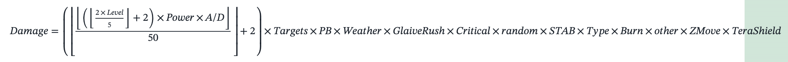
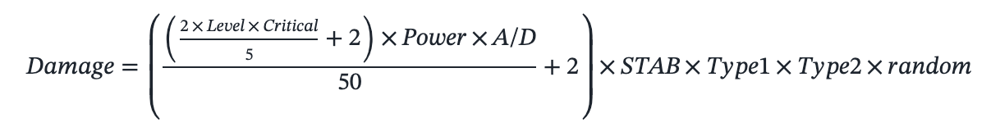

Dette er mitt pokemon spill i terminalen. 

Jeg lager dette prosjektet for å lære meg OOP samtidig som jeg kan lage et kult spill.


Planer for utvilking:
dele class og objektbanker (moves) inn i sine egene filer

få pokemon til å holde styr på sine egene moves sin max og current pp.

finne en måte å legge til type effektivitet. Dicts?

``` python
elementer = {
    "fire": {
        "strong": "ice", "grass", "metal", "bug",
        "weak": "ground", "water", "rock",
        }
    "water": {
        "strong": "fire", "ground","electric",
        "weak": "grass", "electric",,
    }
}
```

dele kalkulasjon av dmg for fysiske moves og spesial moves til å bruke henholdsvis fysisk defence og special defence 


pokemon begynner eventuelt med veldig lange kalkulasjoner for skade


Jeg kommer til å bruke en forenklet versjon av den fra generation 1



Bugs som må fikses:
inputs kan bufferes
input feil i ask for move må renderes bedre


Utvikling av gameloop:
---
1. legge til catch_rate fra API
2. legge til base_experience (exp_yield)
3. hente de 4 nyeste moves lært basert på lvl(wild pokemon encounter)
4. legge til bytting av moves
* * lage en liste med alle tiljengelige moves (løser 3 og 4) perhaps
* * jeg kan også lage en liste med machine-learned moves i samme sleng hvis jeg har lyst til å legge til TMs eller HMs senere
5. legge til exp_rate (hvor mye exp som trengs for lvl up)


